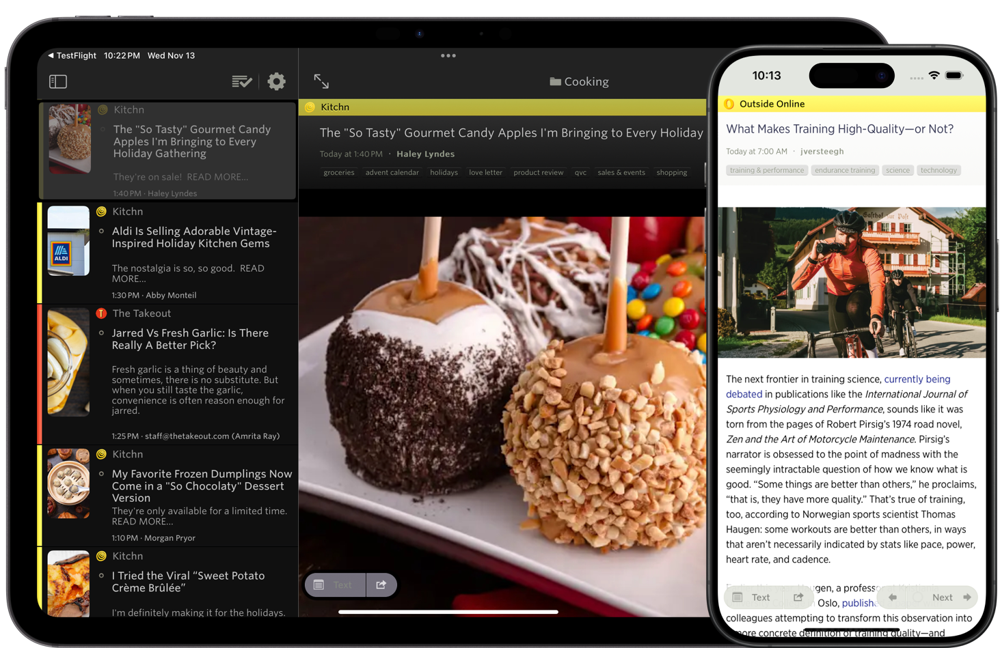
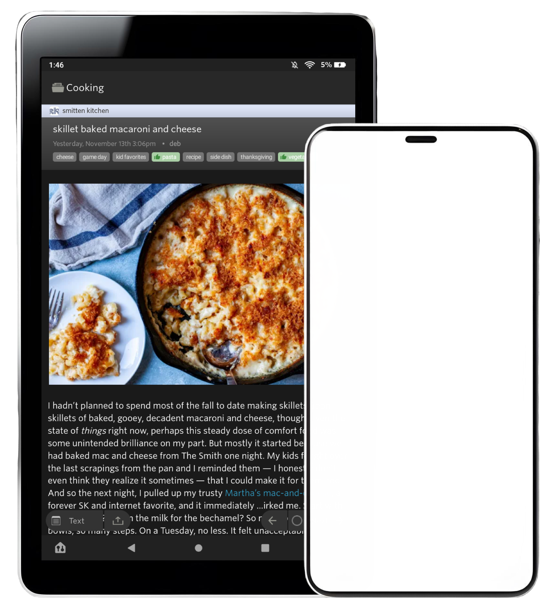

# NewsBlur

<div align="center">

**A personal news reader bringing people together to talk about the world.**
*A new sound of an old instrument.*

[www.newsblur.com](https://www.newsblur.com)


 

<a href="https://f-droid.org/repository/browse/?fdid=com.newsblur" target="_blank">
</a>

<a href="https://play.google.com/store/apps/details?id=com.newsblur" target="_blank">
</a>

<br/>

<a href="https://apps.apple.com/us/app/newsblur/id463981119">
</a>

</div>

## About

NewsBlur is a personal news reader with intelligence. It's an RSS feed reader and social news network that shows the original site while giving you powerful filtering tools. Train NewsBlur to learn what you like and dislike, and it will automatically highlight and hide stories.

NewsBlur is free to use at [newsblur.com](https://www.newsblur.com) (up to 64 sites) with premium plans available, or you can self-host your own instance using this repository.

## Features

- **Real-time RSS** - Stories are pushed directly to you, so you can read news as it comes in
- **Original Site View** - Read the content in context, the way it was meant to be seen
- **Training** - Hide the stories you don't like and highlight the stories you do
- **Shared Stories** - Reading news is better with friends. Share stories on your public blurblog
- **Full Text Search** - Quickly find stories across all of your subscriptions
- **Story Tagging** - Save stories with custom tags for fast references
- **Blurblog Privacy** - Share stories with the world or only with your friends
- **Saved Searches** - Regularly used searches are conveniently given their own feeds
- **Read the Full Story** - The original story from truncated RSS feeds is seamlessly expanded
- **Track Changes** - See how a story evolved since it was first published
- **Email Newsletters** - Read your email newsletters where they belong, in a news reader
- **Multiple Layouts** - Grid, List, Split, or Magazine view for each site
- **Dark Mode** - Easy on the eyes and built into the web, iOS, and Android
- **YouTube Channels** - Even sites that don't publish RSS feeds can be followed
- **Third-party Apps** - Supports Reeder, ReadKit, Unread, and many more
- **IFTTT Integration** - Hook NewsBlur up to nearly every service on the web
- **Native Mobile Apps** - Free iOS, macOS, and Android apps jam-packed with features

## Technology

NewsBlur is a Django application (Python 3.7+) with a Backbone.js frontend. It uses:

- PostgreSQL for relational data (feeds, subscriptions, accounts)
- MongoDB for stories and read states
- Redis for story assembly and caching
- Elasticsearch for search (optional)
- Celery for background tasks (feed fetching)
- Node.js services for text extraction and image processing

## Self-Hosted Installation

This repository contains everything you need to run your own NewsBlur instance with complete control over your data.

**Prerequisites**: Docker and Docker Compose

```bash
git clone https://github.com/samuelclay/NewsBlur.git
cd NewsBlur
make
```

Visit `https://localhost` (type `thisisunsafe` to bypass the self-signed certificate warning).

**Common commands:**
- `make` - Start/update and apply migrations (run after `git pull`)
- `make log` - View web and node logs
- `make logall` - View all container logs
- `make shell` - Django shell with auto-imported models
- `make bash` - Bash shell in web container
- `make test` - Run tests
- `make lint` - Format code (isort, black, flake8)
- `make down` - Stop containers

**Database access:**
- `make mongo` - MongoDB shell
- `make redis` - Redis CLI
- `make postgres` - PostgreSQL shell

See `AGENTS.md` for detailed development guidelines.

### Configuration

To customize your NewsBlur installation, create `newsblur_web/local_settings.py` to override settings from [`docker_local_settings.py`](newsblur_web/docker_local_settings.py).

**Settings for self-hosted installations:**

- `NEWSBLUR_URL` - Your domain (default: `https://localhost`)
- `SESSION_COOKIE_DOMAIN` - Cookie domain for authentication
- `AUTO_PREMIUM` - Give new users premium features (default: `True`)
- `AUTO_ENABLE_NEW_USERS` - Auto-activate new accounts (default: `True`)
- `ENFORCE_SIGNUP_CAPTCHA` - Require captcha on signup (default: `False`)
- `OPENAI_API_KEY` - AI features and Discover for related stories
- `DAYS_OF_UNREAD` - Story retention for premium users in days (default: `30`)
- `DAYS_OF_UNREAD_FREE` - Story retention for free users in days (default: `14`)
- `HOMEPAGE_USERNAME` - Username shown on homepage to unauthenticated users (default: `"popular"`)

**Uncommon settings (for running full newsblur.com):**

- `EMAIL_BACKEND` - Email delivery method
- `STRIPE_SECRET` / `STRIPE_PUBLISHABLE` - Stripe payment processing
- `PAYPAL_API_CLIENTID` / `PAYPAL_API_SECRET` - PayPal payment processing
- `S3_*` settings - AWS S3 bucket configuration for backups, icons, avatars
- `FACEBOOK_APP_ID` / `TWITTER_CONSUMER_KEY` / `YOUTUBE_API_KEY` - Social API keys

See the full list in [`docker_local_settings.py`](https://github.com/samuelclay/NewsBlur/blob/master/newsblur_web/docker_local_settings.py) and [`settings.py`](https://github.com/samuelclay/NewsBlur/blob/master/newsblur_web/settings.py).

## Development with Worktrees

NewsBlur supports Git worktrees for working on multiple features simultaneously, with each worktree running on its own set of ports. This is ideal when working with AI coding assistants like Claude Code.

**Create and start a worktree:**

```bash
git worktree add .worktree/feature-name
cd .worktree/feature-name
make worktree
```

Each worktree automatically gets unique ports based on its directory name:
- Main repo: `https://localhost` (ports 80/443)
- Worktree: `https://localhost:XXXX` (unique ports)

**View your worktree's URLs:**

```bash
make worktree
```

**Follow the worktree logs:**

```bash
make worktree-log
```

**Close a worktree:**

```bash
make worktree-close  # Stops containers and removes worktree if no uncommitted changes
```

All worktrees share the same database services (PostgreSQL, MongoDB, Redis, Elasticsearch), so you can test multiple features without duplicating data.

## Contributing

NewsBlur welcomes contributions! The development workflow:

- Web and Node servers restart automatically when code changes
- Run `make` after `git pull` to apply migrations
- See `AGENTS.md` for code style and development conventions

## Support

- **Hosted service**: [newsblur.com](https://www.newsblur.com) (recommended)
- **Questions, suggestions, and bugs**: [forum.newsblur.com](https://forum.newsblur.com)
- **Development questions**: Check `AGENTS.md` first

## Author

Created by [Samuel Clay](https://www.samuelclay.com) • <samuel@newsblur.com> • [@samuelclay](https://x.com/samuelclay)

## License

MIT License - see [LICENSE](LICENSE) file for details
