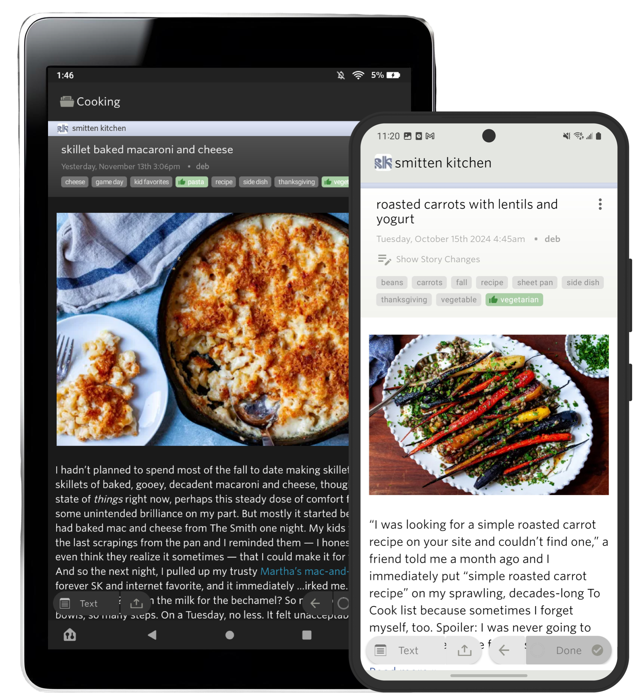

# NewsBlur

<div align="center">

**A personal news reader bringing people together to talk about the world.**
*A new sound of an old instrument.*

[www.newsblur.com](https://www.newsblur.com)

  

<a href="https://f-droid.org/repository/browse/?fdid=com.newsblur" target="_blank">
</a>
<a href="https://play.google.com/store/apps/details?id=com.newsblur" target="_blank">
</a>
<a href="https://apps.apple.com/us/app/newsblur/id463981119">
</a>

</div>

---

## About NewsBlur

NewsBlur is an open-source RSS feed reader and personal news aggregator that emphasizes the reading experience and social interaction. Unlike traditional feed readers, NewsBlur shows you the original site design, making it feel like you're reading the actual website while maintaining the convenience of a feed reader.

**What makes NewsBlur different:**

- **Original Site View**: Read stories in their native design, preserving the publisher's intended presentation
- **Intelligent Filtering**: Hide stories you don't want based on tags, keywords, authors, or publishers
- **Story Highlighting**: Automatically surface stories you care about using the same filtering criteria
- **Social Reading**: Share stories on your blurblog and discuss the news with friends
- **Full-Text Search**: Quickly find stories across all your subscriptions
- **Privacy-Focused**: Self-host your own instance with complete control over your data
- **Newsletter Support**: Subscribe to email newsletters as RSS feeds
- **Offline Reading**: Access your stories and images without an internet connection

NewsBlur is free to use at [newsblur.com](https://www.newsblur.com) (up to 64 sites) with premium plans available, or you can self-host your own instance using this repository.

---

## Technology Stack

NewsBlur is built with a modern web stack designed for scalability and performance:

### Backend

- **[Python 3.7+](https://www.python.org)**: Core application language
- **[Django](https://www.djangoproject.com)**: Web framework powering the API and web interface
- **[Celery](https://docs.celeryproject.org/)**: Distributed task queue for feed fetching and parsing
- **[PostgreSQL](https://www.postgresql.org)**: Relational database for feeds, subscriptions, and user accounts
- **[MongoDB](https://www.mongodb.com)**: Document database for stories, read states, and feed histories
- **[Redis](https://redis.io)**: In-memory database for story assembly, caching, and feed scheduling
- **[Elasticsearch](https://www.elastic.co/elasticsearch/)**: Search engine for full-text story search (optional)
- **[RabbitMQ](https://www.rabbitmq.com)**: Message broker for Celery task distribution

### Frontend

- **[Backbone.js](https://backbonejs.org)**: MVC framework for the web application
- **[jQuery](https://jquery.com)**: DOM manipulation and cross-browser compatibility
- **[Underscore.js](https://underscorejs.org)**: Functional programming utilities
- **Custom UI Components**: Resizable layouts, drag-and-drop, animations, and more

### Infrastructure

- **[Docker](https://www.docker.com) & Docker Compose**: Containerized deployment
- **[Nginx](https://nginx.org)**: Web server and reverse proxy
- **[HAProxy](https://www.haproxy.org)**: Load balancer
- **[Node.js](https://nodejs.org)**: Microservices for text extraction, favicons, and page rendering

---

## Self-Hosting Guide

### Prerequisites

- **[Docker](https://docs.docker.com/get-docker/)**: Latest version
- **[Docker Compose](https://docs.docker.com/compose/install/)**: v2.0 or higher
- **System Requirements**: 4GB RAM minimum, 8GB recommended
- **Disk Space**: ~2GB for images, plus storage for your feed data

### Quick Start

1. **Clone the repository:**

   ```bash
   git clone https://github.com/samuelclay/NewsBlur.git
   cd NewsBlur
   ```

2. **Start NewsBlur:**

   ```bash
   make
   ```

   That's it! The first time you run `make`, it will:
   - Pull all required Docker images
   - Build the containers
   - Set up all databases (PostgreSQL, MongoDB, Redis, Elasticsearch)
   - Run database migrations
   - Load initial bootstrap data
   - Generate SSL certificates for HTTPS

3. **Access NewsBlur:**

   Open your browser and navigate to:
   ```
   https://localhost
   ```

   **Important**: You'll see a security warning about a self-signed certificate. Type `thisisunsafe` directly on the warning page (no input box will appear) to proceed. This is required for local development with HTTPS.

4. **Create an account:**

   Click "Sign Up" and create your first account. You're now running your own personal NewsBlur instance!

### Daily Workflow

After the initial setup, you can use these commands:

```bash
make              # Start containers and apply any new migrations (after git pull)
make log          # View live logs from web and node services
make down         # Stop all containers
make shell        # Open Django shell for interactive debugging
make test         # Run the test suite
```

The `make` command is smart:
- **First run**: Performs full installation
- **Containers stopped**: Starts them up quickly
- **Already running**: Applies any pending migrations

This makes it safe to run `make` after every `git pull` to ensure you're up to date.

### Using a Custom Domain

To run NewsBlur on a custom domain instead of `localhost`:

1. **Run the custom domain script:**

   ```bash
   bash ./utils/custom_domain.sh yourdomain.com
   ```

   This automatically updates:
   - `NEWSBLUR_URL` and `SESSION_COOKIE_DOMAIN` in `newsblur_web/docker_local_settings.py`
   - The domain in `config/fixtures/bootstrap.json`

2. **Add custom subdomains (if needed):**

   Edit `ALLOWED_SUBDOMAINS` in `apps/reader/views.py` to include your subdomain.

3. **Verify the configuration:**

   - Open your browser's Developer Tools (Network tab)
   - Try to log in to NewsBlur
   - Check the POST request to `/login`
   - Look at the Response headers
   - Verify the `set-cookie` header has `Domain=yourdomain.com`

   You can also verify in Django shell:
   ```bash
   make shell
   >>> Site.objects.all()[0]
   ```

**Changing domains:**
```bash
bash ./utils/custom_domain.sh olddomain.com newdomain.com
```

### Working with Existing Databases

If you have an existing NewsBlur database you want to use:

1. **Upgrade your database** to match the Docker image versions in `docker-compose.yml`

2. **Update volume paths** in `docker-compose.yml`:

   ```yaml
   db_postgres:
     volumes:
       - /path/to/your/postgres/data:/var/lib/postgresql/data

   db_mongo:
     volumes:
       - /path/to/your/mongo/data:/data/db:delegated

   db_redis:
     volumes:
       - /path/to/your/redis/data:/data
   ```

3. **Restart with your database:**

   ```bash
   make down
   make
   ```

**Using older database versions:**

Edit the image version in `docker-compose.yml`. For example, to use Postgres 12 instead of 13:
```yaml
db_postgres:
  image: postgres:12.0
```

---

## Contributing

We welcome contributions! NewsBlur is built by the community, and we appreciate help with bug fixes, features, and improvements.

### Development Workflow

NewsBlur uses a modern development workflow with automatic reloading:

- **Web & Node servers**: Automatically restart when you modify code
- **Celery/Task server**: Must be manually restarted with `make bounce` when working on background tasks
- **Database migrations**: Run automatically with `make` or manually with `make migrate`

**Important**: Do NOT run `make nb` or `make rebuild` during development unless you've changed Docker configuration. These commands rebuild all containers unnecessarily and waste time.

### Using Claude Code or AI Agents

If you're using [Claude Code](https://claude.com/claude-code) or other AI coding assistants, check out `AGENTS.md` for development guidelines and conventions specific to NewsBlur.

### Development Commands

#### Essential Commands

```bash
make              # Start/update NewsBlur (applies migrations)
make log          # View logs from web and node services
make shell        # Django shell with shell_plus (IPython with models loaded)
make test         # Run all tests
make lint         # Run code formatting (isort, black, flake8)
```

#### Running Tests

```bash
# Run all tests (fast fail)
make test

# Run tests for a specific app with verbose output
make test SCOPE=apps.rss_feeds ARGS="-v 2"

# Run a specific test class
make test SCOPE=apps.rss_feeds.tests.TestFeedFetching

# Run tests for the newsletter importer
make test SCOPE=apps.newsletter ARGS="-v 2"

# Run reader tests (good examples of integration tests)
make test SCOPE=apps.reader ARGS="-v 2"
```

#### Interactive Development

**Django Shell:**
```bash
make shell
```

This opens an IPython shell with Django's shell_plus, which automatically imports all models. Great for:
- Testing database queries
- Exploring the data model
- Debugging issues
- Running one-off scripts

Example session:
```python
# All models are auto-imported
>>> Feed.objects.count()
>>> user = User.objects.get(username='admin')
>>> user.profile.feeds.all()
```

**Python Debugging:**

1. Add a breakpoint in your code:
   ```python
   import pdb; pdb.set_trace()
   ```

2. Attach to the container:
   ```bash
   make debug
   ```

#### API Testing

Test API endpoints with an authenticated session:

```bash
# GET request
make api URL=/reader/feeds

# POST request with data
make api URL=/reader/mark_feed_as_read CURL_ARGS="-X POST -d 'feed_id=1'"

# Test the river of stories
make api URL=/reader/river_stories CURL_ARGS="-X POST -d 'feeds[]=1&feeds[]=2&feeds[]=3'"
```

The `make api` command automatically handles authentication using a dev session.

### Code Style Conventions

NewsBlur follows consistent code style across the codebase:

**Python:**
- Formatter: Black with line length 110
- Import sorting: isort with Black profile
- Naming: `CamelCase` for classes, `snake_case` for functions/variables
- Follow Django conventions for models, views, and forms
- Always use explicit exception handling

**JavaScript:**
- Use `snake_case` for methods and variables (NOT camelCase)
- Framework: Backbone.js with jQuery and Underscore.js
- Keep code readable and well-commented

**Tests:**
- Test classes: Prefix with `Test_` (e.g., `Test_FeedFetching`)
- Test methods: Prefix with `test_` (e.g., `test_feed_parsing`)
- Write descriptive test names that explain what's being tested

**General Guidelines:**
- Prioritize readability over performance
- Leave no TODOs or placeholders in committed code
- Always reference file names in comments
- Run `make lint` before committing

### Development Tools

#### Git Worktrees

NewsBlur supports Git worktrees for working on multiple branches simultaneously. See the Makefile for worktree-related commands.

#### Sentry Integration

Production NewsBlur uses Sentry for error tracking. If you're working with Sentry integration, configure your auth token in `~/.sentryclirc`.

#### Browser Testing

NewsBlur works with Chrome DevTools MCP for automated browser testing during development.

### Adding Dependencies

**Python packages:**

1. Add the package to `config/requirements.txt`
2. Rebuild the base image:
   ```bash
   make rebuild
   ```

**Node packages:**

1. Add the package to `node/package.json`
2. Rebuild:
   ```bash
   make nb
   ```

### Deployment & Production

For information about deploying to production servers, see the Ansible playbooks in the `ansible/` directory. Production deployment is handled via:

```bash
make deploy_web    # Deploy web servers
make deploy_task   # Deploy celery workers
make deploy_node   # Deploy Node.js services
```

---

## License

NewsBlur is open-source software licensed under the **MIT License**. See the [LICENSE](LICENSE) file for details.

---

## Author & Credits

- Created by [Samuel Clay](https://www.samuelclay.com)
- Email: <samuel@newsblur.com>
- Twitter/X: [@samuelclay](https://x.com/samuelclay) and [@newsblur](https://x.com/newsblur)

NewsBlur is built and maintained by a community of contributors. Thank you to everyone who has helped make NewsBlur better!

---

## Support

- **Documentation**: Check out `CLAUDE.md` and `AGENTS.md` for developer guidelines
- **Issues**: Report bugs on [GitHub Issues](https://github.com/samuelclay/NewsBlur/issues)
- **Hosted Service**: Use NewsBlur at [www.newsblur.com](https://www.newsblur.com) with free and premium plans
- **Community**: Join the discussion on the NewsBlur forum

---

<div align="center">

**[Get Started](#self-hosting-guide) • [Contribute](#contributing) • [newsblur.com](https://www.newsblur.com)**

</div>
