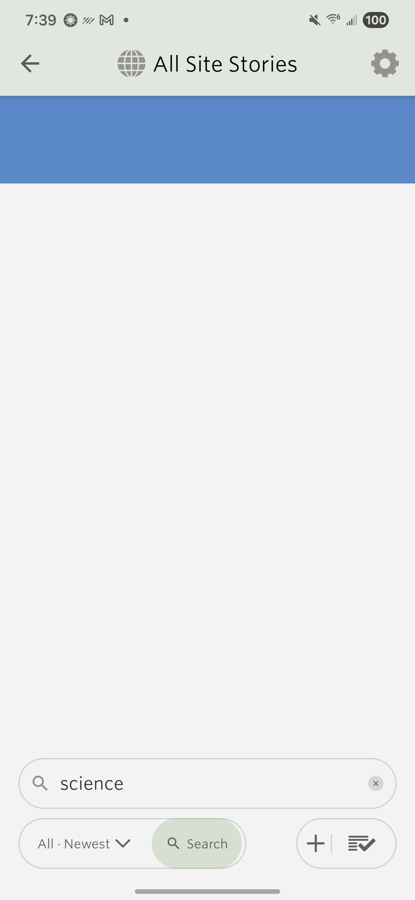
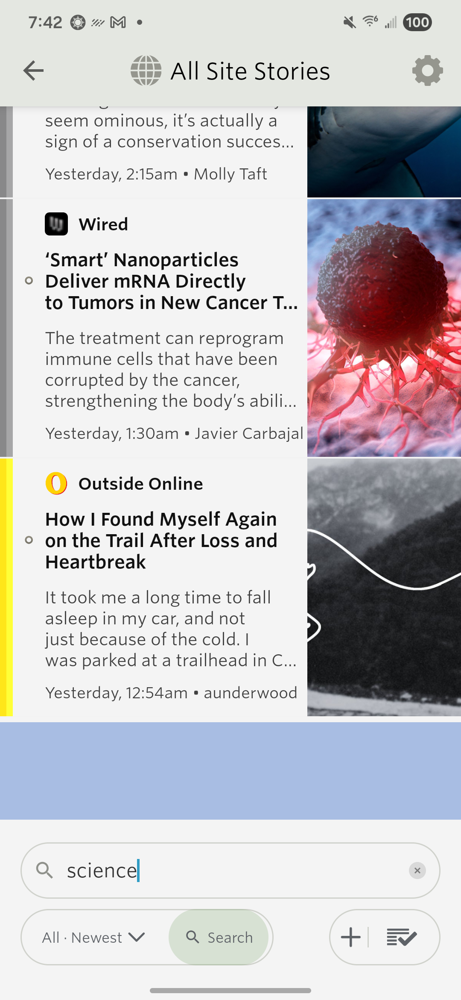
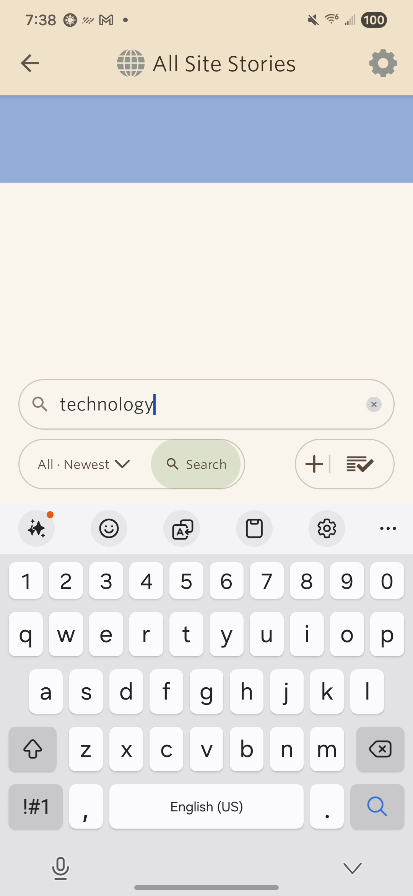
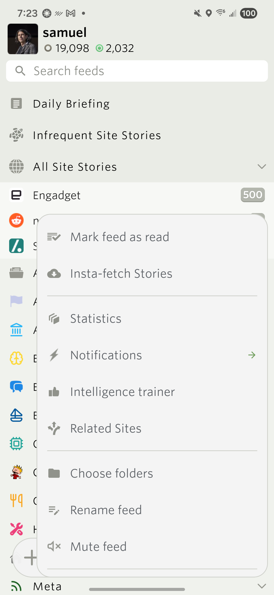
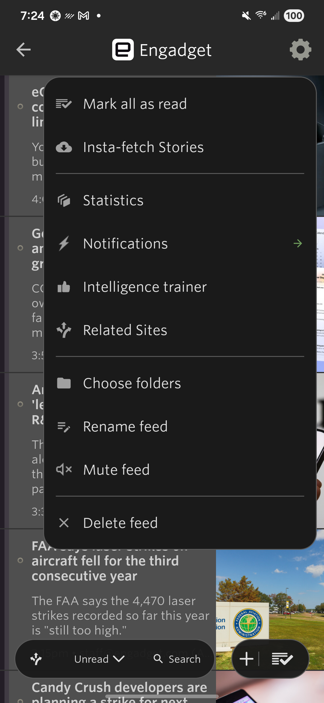
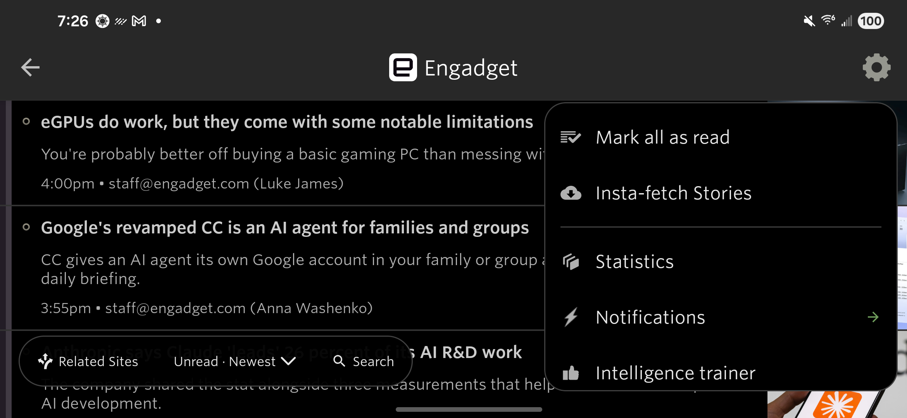
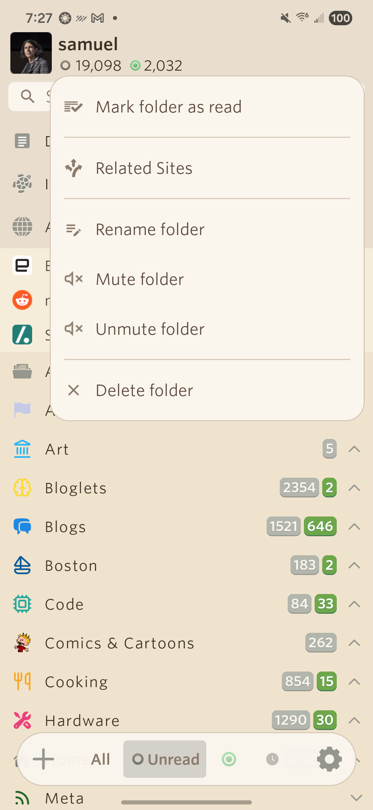
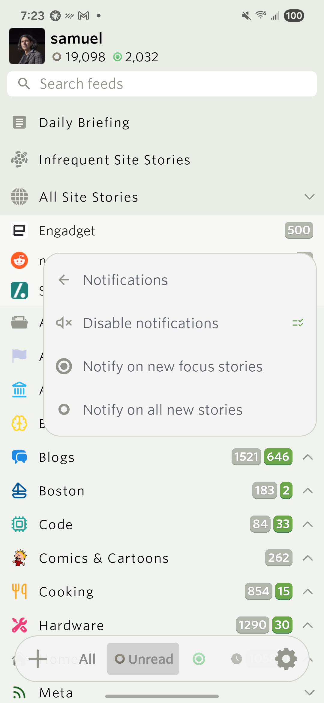

# Android feed menus and story loading, September 17, 2026

Device: attached Samsung Galaxy S22 (SM-S901U1, Android 16). The existing login was preserved; no instrumentation APK was installed.

## Menu behavior

- Feed long press defaults to the complete floating action menu. Explicit saved gestures retain their behavior.
- Main feed-list menus and feed-title settings use the same renderer, icon ordering, separators, and inline Notifications submenu. There is no Cancel row.
- Actions include Insta-fetch Stories, Statistics, Notifications, Intelligence trainer, Related Sites, Choose folders, Rename, and Mute/Unmute where applicable. Destructive actions form the last group.
- The popup keeps its anchor visible and scrolls within the available height in landscape.
- Story menus omit Open feed while already reading that feed. Unit coverage preserves it for ordinary folders, including single-feed folders, and All Site Stories, while excluding special story scopes.

## Verification

`JAVA_HOME='/Applications/Android Studio.app/Contents/jbr/Contents/Home' ./gradlew :app:testDebugUnitTest :app:assembleDebug`

526 tests passed, zero failures/errors/skips. No NewsBlur crash-buffer entries appeared during this validation. Includes default/explicit gesture preferences, feed action grouping, story-menu scope and older/newer actions, loading state transitions, and loading colors for each theme. `git diff --check` passed.

On the Samsung:

- Light, dark, black, and sepia: feed long press, folder long press, checked Notifications submenu, feed-title menu, and story menu.
- All four themes: feed-title and story popovers in portrait and landscape. Main feed-list landscape additionally checked in light, black, and sepia.
- In-feed story menus have both older/newer read actions and no Open feed.
- Choose folders opens the Engadget folder picker; Intelligence trainer opens its feed classifier editor. Both were dismissed without saving.
- Statistics opens the selected Engadget statistics page. Notifications back navigation returns to feed actions without changing a notification preference.
- At 1.3 system font scale, action labels remain readable and scrolling reaches Delete feed.
- Open feed remains available in the All Site Stories story menu, verified on the device.
- No mark-read, delete, mute, notification, rename, or folder-membership changes were submitted during these checks.

## Loading behavior and device proof

The story list uses a full-width 76dp blue pulse instead of Loading text, both before the first results and after the final currently loaded story during pagination. Colors are centralized for light, dark, black, and sepia. The animation stops when the view is hidden/detached, honors disabled animations/power saving, and does not pulse offline or after exhaustion.

- Recorded actual story entry in all four themes. Light and sepia fresh searches exercised sustained initial loading; a light-theme search exercised pagination with the bar immediately beneath the final loaded story.
- An 8-second Samsung pagination recording measured color peaks at 0.6, 2.3, 4.0, 5.7, and 7.4 seconds, confirming the web's 1.7-second cycle. [Two recorded cycles](pagination-pulse.mp4).
- A temporary local CONNECT tunnel delayed encrypted responses for the sustained checks. TLS was not intercepted, and response contents were not logged. Correction from the subsequent device investigation: deleting `http_proxy` left Android's derived proxy host and port active. Requests failed after the tunnel stopped. Setting `http_proxy` to `:0` cleared that retained state; successful real API pagination was then verified. See [the follow-up validation](../menu-swipe-fixes-2026-09-17/README.md).
- Offline search displayed Offline without a Loading stories accessibility node. An empty search result stopped the pulse and displayed No stories to read. Unit tests additionally cover pagination completion and exhausted feeds.
- Rotation retained the current search/story context; the floating search controls also remained usable above Samsung's landscape keyboard.

| Initial load | Pagination |
| --- | --- |
|  |  |

Original theme, confirmation and mark-on-scroll preferences, system font scale, and auto-rotation were restored. Network cleanup required the correction documented above. The updated debug build remains installed with the existing account session.

## Screenshots

| Feed long press | Feed-title actions |
| --- | --- |
|  |  |

| Landscape | Folder actions |
| --- | --- |
|  |  |

These commits follow the already submitted 15.0.2 test-track build. They are not part of its uploaded AAB, and its release tag has not been moved.
