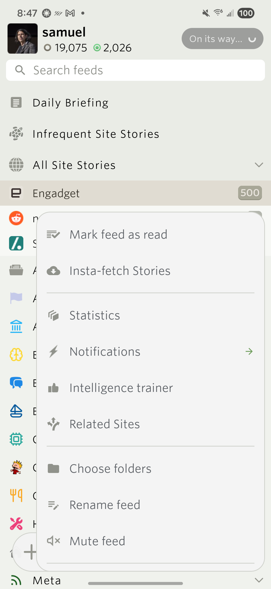
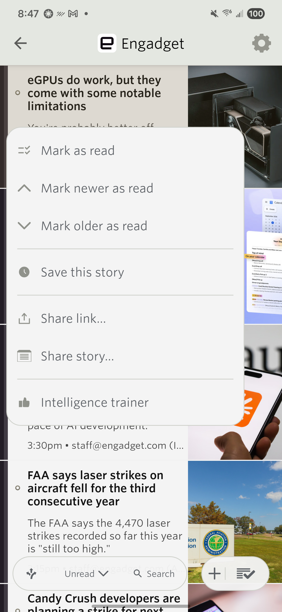
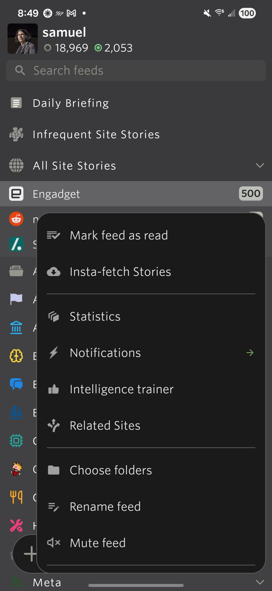
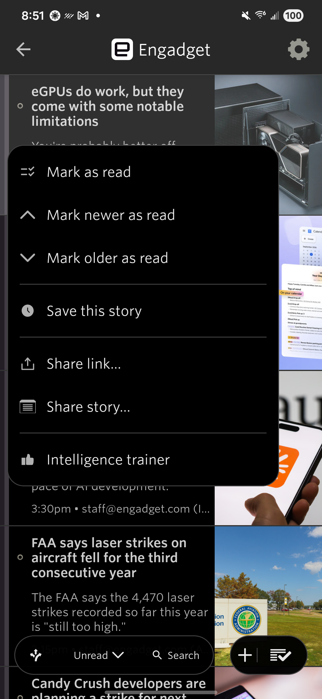
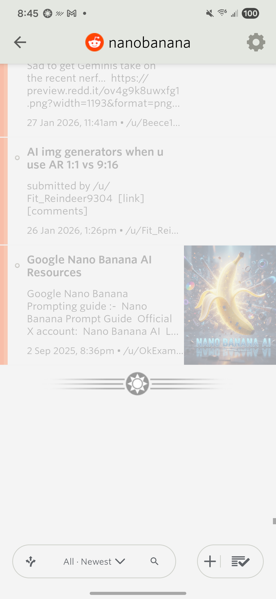
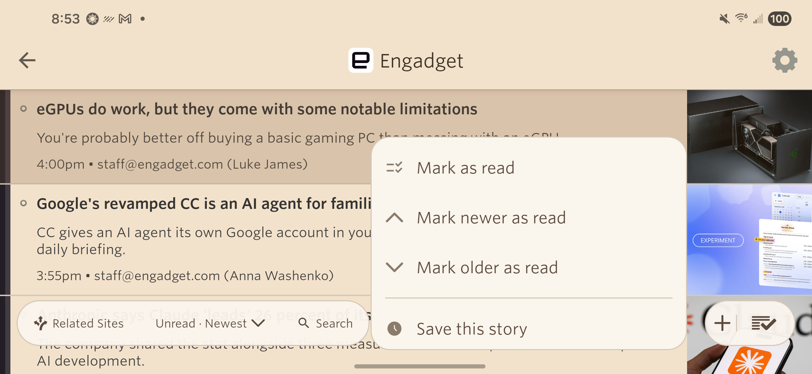
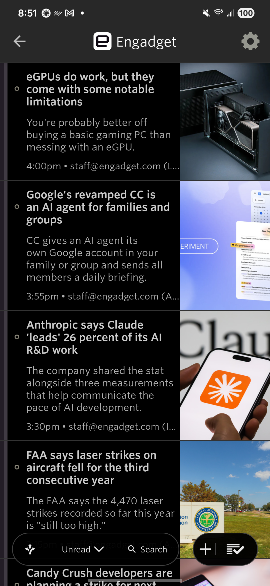

# Story list swipe, menu highlights, and pagination

Samsung Galaxy S22 (SM-S901U1, Android 16), existing account session preserved. Changes follow the already submitted 15.0.2 AAB; no version or release tag was changed.

## Swipe flash

[Before](swipe-before.mp4) and [after](swipe-after.mp4) recordings of the physical device show the interactive swipe from Nano Banana back to the feed list. The original recording includes a brief fullscreen return of the departing story list. Frame-by-frame inspection of the new recording shows continuous departure with no return.

`ItemsList.onPause()` previously reset the translated surface to x=0 during `finish()`. Finishing activities now keep that translation until their window is removed. Ordinary pauses still reset interrupted gestures. Destruction cancels animation and releases the snapshot without restoring the departing surface.

Three lifecycle tests cover finishing pause, ordinary pause, and destruction. The finishing-pause test failed before the fix. A reversed drag was also canceled successfully on the device, returning to the story list.

## Menu highlights

Feed and story rows retain a subtle theme-colored overlay while their action menu is open, including Notifications submenus. Story highlighting includes the thumbnail. The original foreground and background are preserved; dismissal, action selection, detach, and recycling remove the overlay.

The renderer regression failed before the change and passes for all four palettes, separate menu anchors and highlighted rows, and teardown. Physical screenshots:

| Feed menu | Story menu |
| --- | --- |
|  |  |
|  |  |

## Pagination and network correction

The initial Nano Banana failure was caused by retained Android proxy state from the previous loading-animation test. Deleting the global `http_proxy` setting did not clear `global_http_proxy_host` and `global_http_proxy_port`. Setting `http_proxy` to `:0` cleared them. Successful real requests were then observed through page 40, which returned zero stories, and the existing fleuron appeared below the last story.

A separate regression allowed satisfied viewport checks to assign `pendingFeed` without scheduling work, leaving a false loading state. Smaller viewport checks could also shrink an in-flight pagination target. Both were reproduced with failing tests. Pending state is now changed only when scheduling work, larger existing targets are preserved, and sync completion publishes its status after clearing pending state. Additional tests cover filtered counts, cached feeds, session switching, explicit resets, and generation safeguards.

## Automated verification

`JAVA_HOME='/Applications/Android Studio.app/Contents/jbr/Contents/Home' ./gradlew :app:testDebugUnitTest :app:installDebug`

537 tests passed with zero failures, errors, or skips. The debug APK was installed on the attached Samsung without instrumentation or resetting its login. `git diff --check` passed.

## Physical device coverage

- Light, dark, black, and sepia: feed menus and Notifications submenus retain the selected feed highlight.
- All four themes: portrait and landscape story menus retain the complete row highlight. Back dismissal restores the ordinary row. Light dismissal was repeated after an overlapping manual interaction during the first capture.
- Portrait light and [landscape black](black-landscape-swipe-after.mp4): recorded completed back gestures and inspected their frame sequences. Neither recording shows the former fullscreen flash.
- Reversing a partially completed drag cancels navigation and restores the story list.
- Successful Engadget page 1, 2, and 3 requests were verified again after installation and preference restoration. No NewsBlur crash entries appeared in the device crash buffer.
- Original AUTO theme, mark-on-scroll, confirmation preference, portrait setting, and auto-rotation were restored. Proxy host is empty and port is zero; `http_proxy=:0` deliberately remains to clear Android's derived proxy state. No temporary proxy or reverse tunnel is required.

