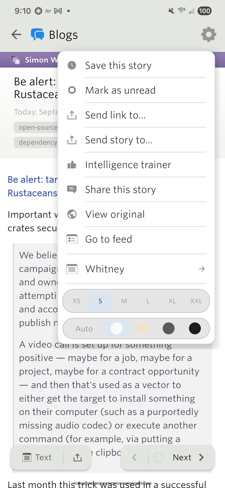
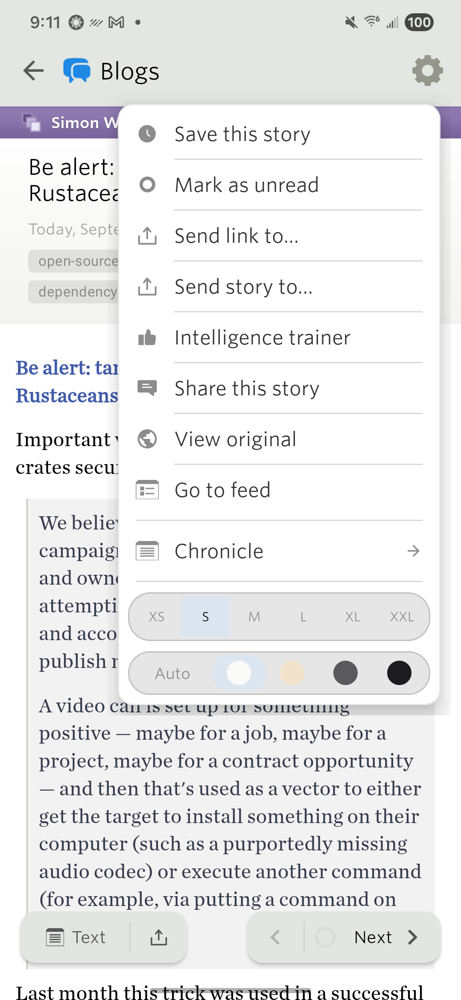

# Story tap highlight and reader font name

Samsung Galaxy S22 (SM-S901U1, Android 16), existing login preserved. Followups on `android-add-discover-sites`; no version bump or new Play upload.

## Changes

- The tapped story now receives the existing story-selection background before reader launch. It stays held during launch and same-story read-state rebinding. The existing one-second return fade, its colors, and its visibility gating are unchanged.
- Tapping again during an earlier return fade cancels that fade and starts a new hold. Invalid/debounced taps do not replace selection; a failed launch restores the background.
- Direct related-story reader launches use the same hold. Daily Briefing's separate activity lifecycle and related-story navigation that opens a different feed list retain their prior behavior.
- The default font label now says Whitney, matching `Font.DEFAULT` and its bundled `whitney_ssm_book_bas.otf`. Reader menu, picker, and settings share the label. Stored preference values remain unchanged.

## Verification

An additional regression covers returning to an already-read story while an identical refresh is pending. Such a refresh emits no row changes, so the adapter explicitly schedules the presentation frame needed to start the fade after the refresh commits. This regression also failed before its fix.

The tap regression failed before the fix with `Tap highlight must already be held when reader launch starts expected not same`. Seven opening tests plus existing return lifecycle tests cover launch ordering, repeated taps, invalid/debounced clicks, failure restoration, direct cluster navigation, Daily Briefing, rebinds, and visibility-gated fading.

`JAVA_HOME='/Applications/Android Studio.app/Contents/jbr/Contents/Home' ./gradlew :app:testDebugUnitTest :app:installDebug`

546 tests passed, zero failures/errors/skips. Installed onto the physical Samsung without instrumentation or resetting account state.

[Folder-view tap and return, light theme](folder-tap-light.mp4): the first row remains highlighted until the reader covers it, then fades after returning. The recording was inspected through the launch and return transitions.

The reader font row was verified as Whitney, changed to Chronicle in the picker, and verified as Chronicle when reopening the menu. Whitney was selected again afterward.

| Default font | Explicit selection |
| --- | --- |
|  |  |

Final device pass: folder story opening and return were recorded in light/black portrait and dark/sepia landscape. All four checks asserted a real story-title row was visible after return and sampled the settled row background: light `(244,244,244)`, dark `(79,79,79)`, black `(0,0,0)`, sepia `(243,226,203)`. This catches the already-read highlight remaining stuck, rather than merely verifying navigation.

[Dark landscape recording](folder-tap-dark-landscape.mp4). The initial unread story and subsequent already-read story were both exercised. No NewsBlur crash-buffer entries appeared.

Original AUTO theme, font preference, mark-on-scroll, confirmation setting, portrait orientation, and auto-rotation were restored. The final debug build remains installed, with the Blogs folder open for manual testing.
