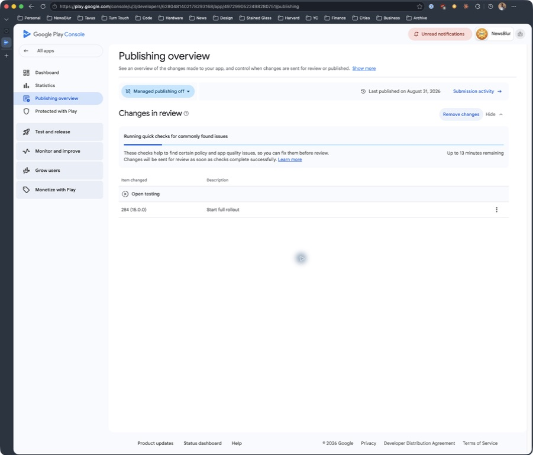

# Android 15.0.0 testing release

## Build

- Version: `15.0.0` / version code `284`
- Package: `com.newsblur` (signed Play release bundle)
- Source commit and tag: `66f229ec95`, `Android_15.0.0`
- Build command: `:app:testDebugUnitTest :app:bundleRelease`, with Android Studio's JBR and existing release signing credentials supplied locally.
- Validation: 471 unit tests pass; release optimization and lint-vital tasks pass; AAB manifest reports the package/version above; ZIP integrity passes; JAR signature verifies.
- Certificate SHA-256 matches the prior bundle: `5C:5E:93:50:3C:6A:C4:89:88:6A:29:BE:0C:28:6B:A6:04:82:E2:C2:5A:A6:D6:EF:56:84:FD:6E:8F:D7:C3:19`.
- Bundle SHA-256: `0d7e19357944aa0e5f9792df91558ff2c5ded2707d199ff79dd8c1ff657ba0eb`
- Bundle size: 11,262,241 bytes.

## Archived artifacts

The existing uploads folder is in iCloud Drive, rather than Dropbox:

`~/Library/Mobile Documents/com~apple~CloudDocs/NewsBlur/Android/Builds/`

- `NewsBlur-15.0.0.aab`
- `NewsBlur-15.0.0-testing-notes.txt`
- `NewsBlur-15.0.0-mapping.txt`

[English release notes](en-US.txt) contain 499 Unicode characters excluding the final newline, within [Google Play's 500-character limit](https://support.google.com/googleplay/android-developer/answer/9859348?hl=en).

## Store status

**Submitted to open testing on September 15, 2026.** Uploaded the archived AAB through Play Console using the app owner's account. Play accepted version `284 (15.0.0)` and the 499-character English release notes.

- Track: **Open testing**, full rollout to that track's testers. No production release was submitted.
- Validation: no blocking errors and no loss of supported devices. One non-blocking warning recommends uploading native debug symbols; the ReTrace mapping file is attached to the bundle.
- Submitted the single pending change, `284 (15.0.0) — Start full rollout`, using **Send changes for review**.
- Verified terminal UI state: **Changes in review**, with quick checks still running. This records submission, not confirmed availability to testers.
- Managed publishing is off; Google Play controls review completion and subsequent availability.
- [Publishing overview](https://play.google.com/console/u/3/developers/6280481402178293168/app/4972990522498280751/publishing)
- [Release review](https://play.google.com/console/u/3/developers/6280481402178293168/app/4972990522498280751/tracks/4698162496597079541/releases/97/review)

