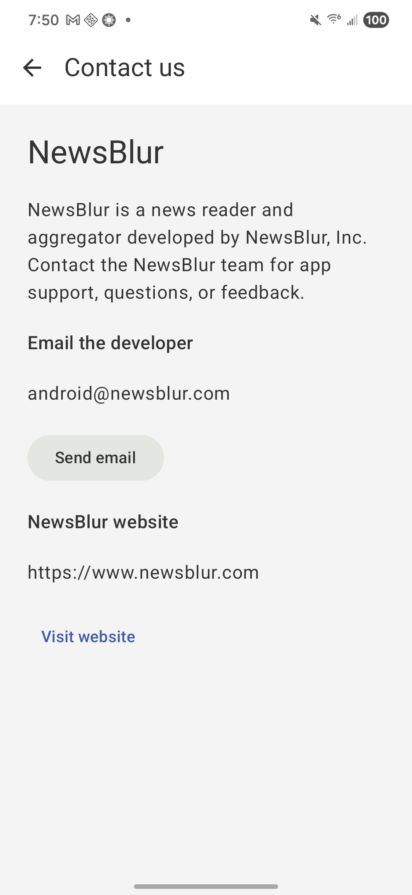
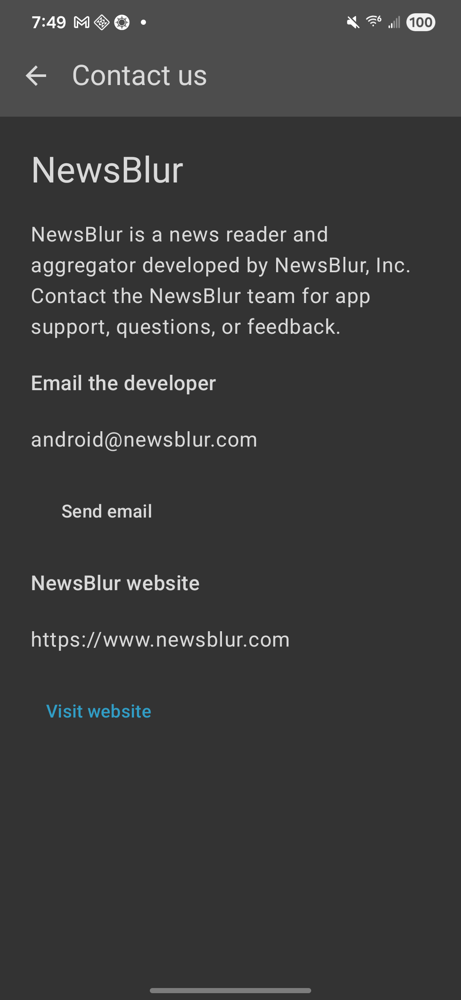
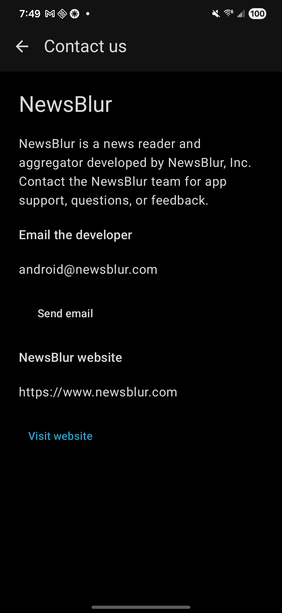
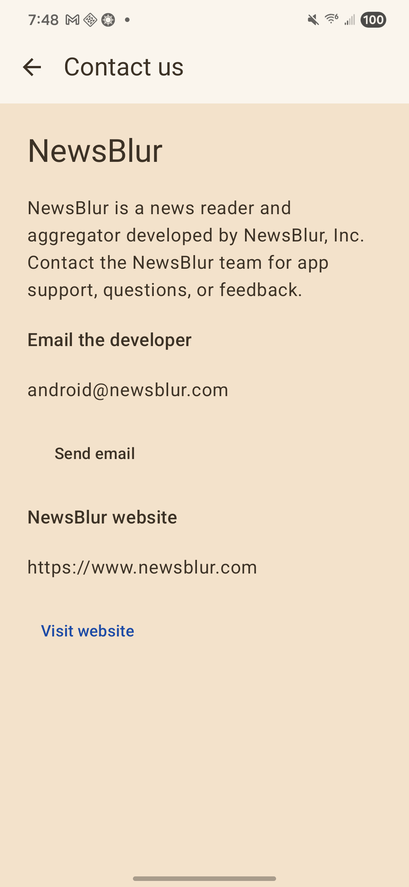

# News and Magazines contact policy fix

Google Play's September 16, 2026 rejection identifies a missing clearly labeled website and in-app contact page. The email cites version code 283; the live publishing overview separately showed 284 (15.0.0) in review for open testing.

## Implemented

- Android main menu and login screen link to a native Contact us page.
- The page identifies NewsBlur, Inc. and displays selectable android@newsblur.com and the NewsBlur website without requiring an email client, login, or network request.
- Send email opens a plain email intent; missing email/browser handlers show an explanatory message.
- Public /contact page identifies Samuel Clay at NewsBlur, Inc., with general and Android support email links. Website footer and About link to it.

## Verification

- Android regression test failed before implementation and passes after it.
- Two website regression tests failed before implementation and pass after it.
- Debug APK built and installed on the existing Samsung SM-S901U1, preserving the logged-in session.
- Contact page opened through the actual main menu in Light, Dark, Black, and Sepia; screenshots below include final link contrast and system bar icon fixes.
- Send email opened the mail composer addressed to android@newsblur.com; no email sent. Visit website opened the NewsBlur website in the device browser.
- Public website page rendered and was visually checked at http://localhost:8748/contact.
- Four-theme Compose instrumentation coverage compiles; instrumentation was not installed or run on the shared phone.
- Alpha APK also builds and installs. Both existing app installations have logged-in accounts, so the login-screen contact link was reviewed in code but not exercised on-device; neither account was logged out.
- Original Auto theme restored after device checks.

## Deployment and corrected release

The website is deployed and verified publicly at https://www.newsblur.com/contact. Corrected Android version **15.0.0 (285)** is submitted to open testing and shows **Changes in review**. [Build and submission details](../15.0.0-285/README.md).

Verified Play Console settings already show News & Magazines, samuel@newsblur.com, and https://www.newsblur.com. These needed no correction. After verifying the live contact page, the News and magazine apps declaration was updated from https://newsblur.com/about to https://www.newsblur.com/contact and included with the corrected build's review submission.

